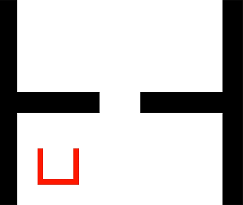
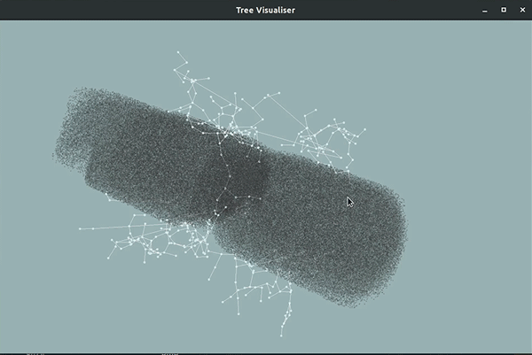

# Projet S7

Planification et exécution de trajectoire pour la manipulation d'objets encombrants avec une plateforme mobile holonome.

Auteurs : Tariq Berrada, Julien Perichon, Nicolas Risse

## Exemple de résultat

Animation du mouvement du robot:

arbre généré par RRT* dans l'espace d'état *(x, y, theta)*.

## Liens utiles

- Shapely, pour avoir une API qui permet de gérer facilement un ensemble de polygones : https://shapely.readthedocs.io/en/stable/index.html 
- Glumpy, pour utiliser OpenGL sous Python : https://glumpy.github.io/ 
- Documentation Hokuyo (Laser scans) : http://wiki.ros.org/hokuyo_node 
- Documentation PyYaml : https://pyyaml.org/wiki/PyYAMLDocumentation
- Documentation youbot_common : http://wiki.ros.org/youbot_common

## Installation de shapely

pip install shapely[vectorized]

## Installation des drivers youbot

Dans catkin_ws/src/ faire:
- git clone https://github.com/youbot/youbot_driver.git
- git clone https://github.com/mas-group/youbot_description.git
- git clone https://github.com/mas-group/youbot_simulation.git

Ensuite faites un lien symbolique vers le package ros dans votre catkin workspace :
- ln -s <chemin/package/ros> <chemin/dans/catkin/workspace>

## Installation de la librairie de visualisation python (projetS7_lib)

Dans projet-s7/python_code faire la commande :
- python2 setup.py install --user

Pour importer une des classes de la librairies dans un fichier python, faire :
- import projetS7_lib.classe_a_importer

## Utilisation KukaYoubot

- Hostname : kuka1.smart.metz.supelec.fr
- Login : youbot
- Password : youbot

Démarrage :
- Pression longue sur le bouton power
- Deuxième pression pour démarrer le PC

Ensuite on peut se logger en ssh sur le robot et démarrer le roscore avec la commande suivante :

roslaunch youbot_driver_ros_interface youbot_driver.launch youBotHasArms:=false

ce launch devrait démarrer les noeuds ROS pour pouvoir contrôler le youbot.

Pour éteindre : pression longue sur le bouton power.

Pour démarrer les noeuds du Hokuyo (le laser scan), pas sûr qu'il soit démarré avec le launch file plus haut ; il faut peut être démarrer un hokuyo_node (http://wiki.ros.org/hokuyo_node)

Vous pouvez installer une simulation gazebo youbot qui doit être le paquet youbot_simulation [2] et cela vous permet de disposer d'un youbot en simulation. 

N'hésitez pas à créer un launch file dédié sur le youbot qui démarre uniquement les noeuds dont vous avez besoin (cf les launchs du github de youbo_ros_interface [1])

- [1] https://github.com/youbot/youbot_driver_ros_interface/tree/indigo-devel/launch
- [2] https://github.com/youbot/youbot_simulation

## Exemple de résultat

